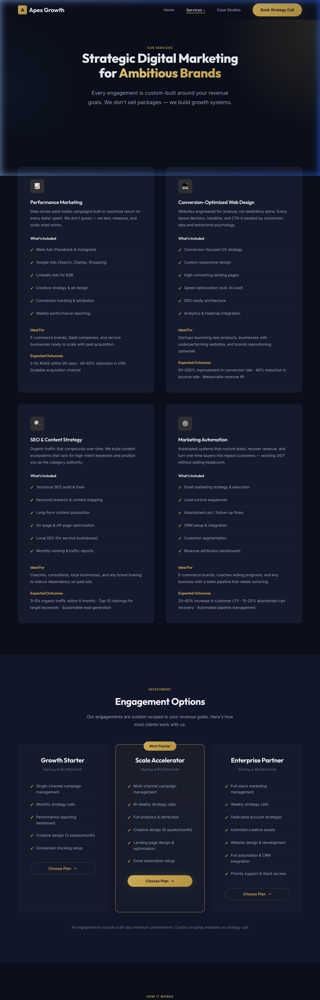
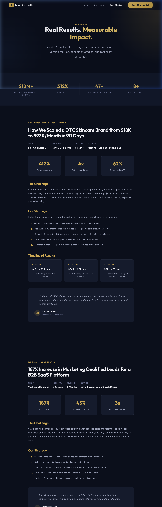
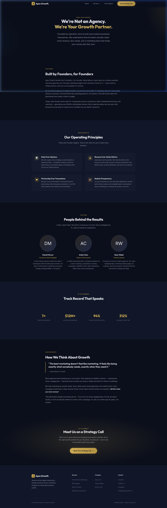
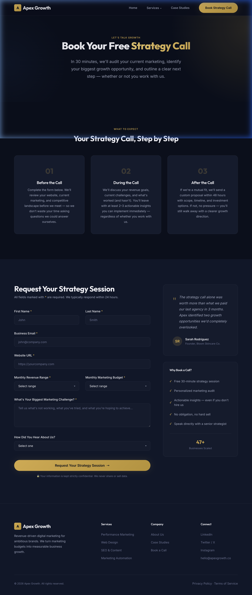
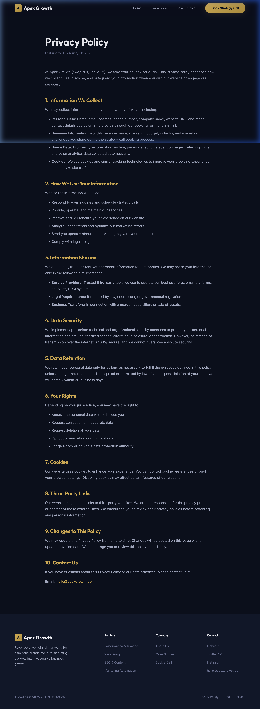
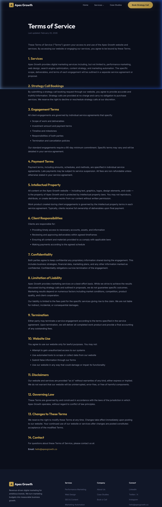

# Apex Growth — Premium Digital Marketing Agency Website

A premium, dark-mode digital marketing agency website built with **HTML**, **CSS**, and **JavaScript**. Designed for high-ticket client acquisition with conversion-focused copywriting, animated data dashboards, and a luxurious visual identity.

## ✨ Features

- **Premium Dark Mode Design** — Deep navy/charcoal palette with electric gold accents
- **Interactive Dashboard** — Animated marketing analytics dashboard in the hero section
- **Services Dropdown Navigation** — Hover-triggered dropdown with service categories
- **Pricing Tiers with Modal** — "Choose Plan" buttons trigger a confirmation modal with email capture
- **Case Studies** — Three detailed case studies with animated result counters
- **Booking Form** — Qualifying strategy call form with validation
- **Scroll Animations** — Intersection Observer-based reveal animations throughout
- **Fully Responsive** — Works across desktop, tablet, and mobile
- **Legal Pages** — Privacy Policy and Terms of Service pages

## 📸 Screenshots

### Homepage


### Services & Pricing


### Case Studies


### About Us


### Book a Strategy Call


### Privacy Policy


### Terms of Service


## 🛠 Tech Stack

| Technology | Purpose |
|---|---|
| HTML5 | Semantic structure |
| CSS3 | Custom properties, glassmorphism, animations |
| Vanilla JS | Scroll animations, counters, form validation, modals |
| Google Fonts | Inter (body) + Outfit (headings) |

## 📁 Project Structure

```
├── index.html          # Homepage with hero dashboard
├── services.html       # Services + pricing tiers + plan modal
├── case-studies.html   # Three detailed case studies
├── about.html          # Team & company story
├── book.html           # Strategy call booking form
├── privacy.html        # Privacy policy
├── terms.html          # Terms of service
├── styles.css          # Complete design system & styles
├── script.js           # Animations, counters, modals, validation
├── screenshots/        # Website screenshots
└── README.md           # This file
```

## 🚀 Getting Started

1. Clone the repository:
   ```bash
   git clone https://github.com/SonuSharmaFiles/digital-marketing-website.git
   ```
2. Open `index.html` in your browser — no build step needed!

## 🎨 Design System

- **Colors:** Dark premium palette (`#0A0F1C` background, `#D4A843` gold accent)
- **Typography:** Outfit (headings) + Inter (body) from Google Fonts
- **Spacing:** 4px base unit with consistent scale
- **Effects:** Glassmorphism cards, radial glows, smooth transitions
- **Animations:** Scroll-triggered reveals, animated counters, floating dashboard

## 📄 License

This project is open source and available under the [MIT License](LICENSE).
